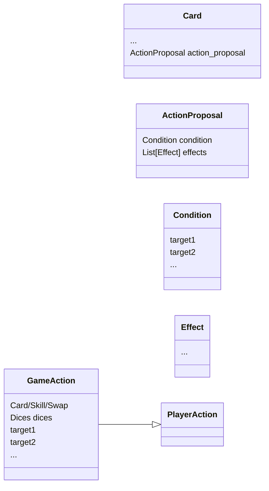

# Event Handling Design

```mermaid
classDiagram
    direction RL
    class Card {
        ...
        ActionProposal action_proposal
    }

    class ActionProposal {
        Condition condition
        List[Effect] effects
    }

    class Condition {
        target1
        target2
        ...
    }

    class Effect {
        ...
    }

    class PlayerAction {
    }

    PlayerAction <|-- GameAction
    class GameAction {
        Card/Skill/Swap
        Dices dices
        target1
        target2
        ...
    }
```
