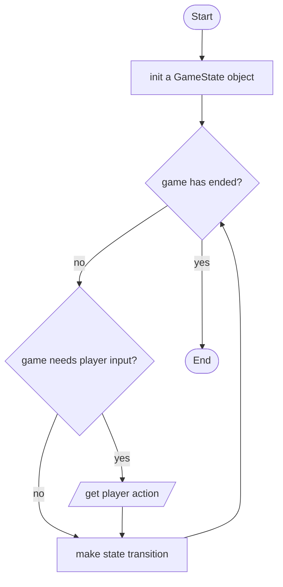
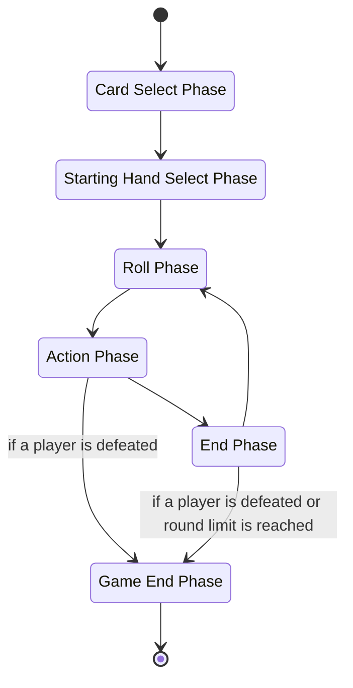

# State Machine Design

Please note that some parts of this design document is simplified for easier understanding.

## Normal Game Flow (Linear Game Flow)

The `GameState` class is definitely the essence of this project,
which contains all information about any moment of a particular game.

With the information that is contained solely in a `GameState` instance,
the game can run itself.

Below shows how running a normal gameplay is like with a `GameState` instance.



## What a GameState Contains

Let me show you what a `GameState` instance contains in pseudocode.

```pseudocode
class GameState:
    mode: Mode
    phase: Phase
    round: int
    active_player_id: Pid
    player1: PlayerState
    player2: PlayerState
    effect_stack: EffectStack
```

Let me go over each of its fields.

- `mode`: contains information about the game mode of the entire game
- `phase`: contains all the logics for handling how the game state make the next transition.
           e.g. executing an existing `effect`, asking for player action, transit to next phase
           based on the `mode`
- `round`: an int representing which round the current game is in
- `active_player_id`: tells which player is the active player in this game state
- `player1`: contains all information about the player, including characters, summons,
             and so on
- `player2`: the other player which is the opponent of `player1`
- `effect_stack`: contains the `effect`s waiting to be executed. Each `effect` can transit the
                  game state to the next as programmed. e.g. a damage effect deals damage to
                  opponent, a swap character effect changes the active character of a player...

## How GameState Makes a Transition

### Transition Without Player Action

`GameState` passes itself to `phase` it contains,
and let `phase` make the transition.

`phase` first checks if the transition request is valid.
(Checks if player action is required or the game has ended)
If the transition request is valid, then a new `GameState` instance
is returned based on the one passed in above.

`phase` may make changes like, removing and executing an effect, changing player state,
move on to the next phase based on `mode` by assigning the new game state with a
new `Phase`.

### Transition With Player Action

`GameState` passes itself and the player action got to `phase` it contains,
and let `phase` make the transition.

`phase` first checks if the player action is expected at the current state,
also checks if the action self is valid.
(Is the card played is in hand?
Is the player allowed to take an action?
Has enough dices be paid for the action...)

Then `phase` make changes like, pushing new effects to the `effect_stack`...

## Phase Transitions of Default Game Mode



## Action Phase Player Action Handling

The other phases are relatively simple, so let's discuss the action phase more.

### Example: Play the Card "Mondstadt Hash Brown"

Let's start with a simple example when the card "Mondstadt Hash Brown" is played.

As described above, `GameState` passes itself and the player's card action to
`phase` which must be _Action Phase_ in this case.

From the player action, `phase` can know:

- Which card the player wants to play
- Which target the card is used on
- Which dices the player wants to use to pay for the action

`phase` then go over each piece of information to check if the action is valid.

- Does the player has "Mondstadt Hash Brown" in hand?
- Is the target an alive character of this player that is not satiated?
- Can the dices pay for the card and does the player have the dices they stated?

If everything goes fine, then a number of things happen.

- Dices paid are removed
- Effects of the card is pushed to the `effect_stack`

Note that all changes above is done to a copy of the current game state,
and the modified copy is then returned as the next state.

The effects added for this "Mondstadt Hash Brown" looks like this. (in execution ordered)

```pseudocode
1. PublicRemoveCardEffect
   - pid: P2
   - card: MondstadtHashBrown
2. RecoverHPEffect
   - target: {pid: P2, zone: Characters, character_id: 1}
   - recovery: 2
3. AddCharacterStatusEffect
   - target: {pid: P2, zone: Characters, character_id: 1}
   - status: SatiatedStatus
```

I believe the effects are quite self-explanatory, except the part in `{...}`.
That is just the internal way to specify a particular target in the game,
which is a character with id 1 of player2 in this case.

### Example: Play the Card "Cold-Blooded Strike"

The action is handled quite similar to how "Mondstadt Hash Brown" is handled above.

The effects are:

```pseudocode
1. PublicRemoveCardEffect
   - pid: P1
   - card: ColdBloodedStrike
2. AddCharacterStatusEffect
   - target: {pid: P1, zone: Characters, character_id: 1}
   - status: ColdBloodedStrikeStatus
3. CastSkillEffect
   - target: {pid: P1, zone: Characters, character_id: 1}
   - skill: ElementalSkill1
4. AllStatusTriggererEffect
   - pid: P1
   - signal: CombatAction
5. TurnEndEffect
```

`PublicRemoveCardEffect` is executed first to remove the card.

Then `AddCharacterStatusEffect` adds the `ColdBloodedStrikeStatus` to this character.

After that, `CastSkillEffect` is executed to generate the effects for the skill.
If the target character cannot cast the skill at when the effect is executed,
then not effects are generated.

So after `CastSkillEffect` is executed, the `effect_stack` looks like this:

```pseudocode
1. ReferredDamageEffect
   - source: {pid: P1, zone: Characters, character_id: 1}
   - target: OppoActive
   - element: Cryo
   - damage: 3
   - damage_type: ElementalSkill
2. EnergyRechargeEffect
   - target: {pid: P1, zone: Characters, character_id: 1}
   - recharge: 1
3. BroadCastSkillInfoEffect
   - source: {pid: P1, zone: Characters, character_id: 1}
   - skill: ElementalSkill1
4. SwapCharacterCheckerEffect
   - my_active: {pid: P1, zone: Characters, character_id: 1}
   - oppo_active: {pid: P2, zone: Characters, character_id: 1}
5. DeathCheckCheckerEffect
6. AllStatusTriggererEffect
   - pid: P1
   - signal: CombatAction
7. TurnEndEffect
```

The first two effects should be somewhat obvious.

`BroadCastSkillInfoEffect` notifies all statuses that some event has happened,
some statuses may save the notification inside themselves for later use.

`SwapCharacterCheckerEffect` checks if the active character of any player have been changed.
If so, some more subsequent effects are added to handle the character swap.
I'm not going into details here. Spoiler: this effect can handle Kaeya's burst with
the reaction Overloaded well.

`DeathCheckCheckerEffect` checks if the active character of any player is dead.
If so, some effects are added to handle the 'inserted' death swap.

`AllStatusTriggererEffect` generates triggering effects for each status in current
game state in order according to the game's rule.
Each status may respond to the triggering effect by adding more effects to the stack.
Whether respond or not depends on the implementation of each status.
In this case, `ColdBloodedStrikeStatus` has been broadcasted about the cast of the skill
from its equipper before, so it emits some effects to heal the equipper as well as
updating itself as used in this round.

`TurnEndEffect` switches the player in action. That is make player2 the active
player in this case.
