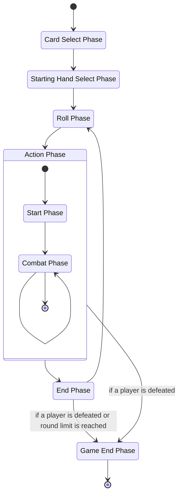
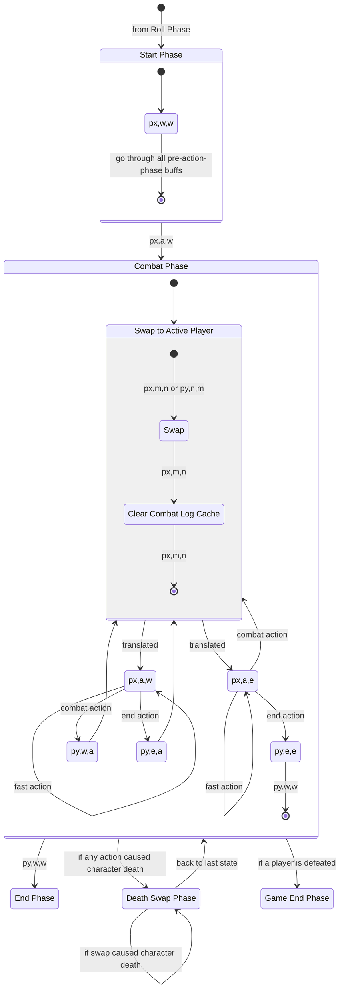
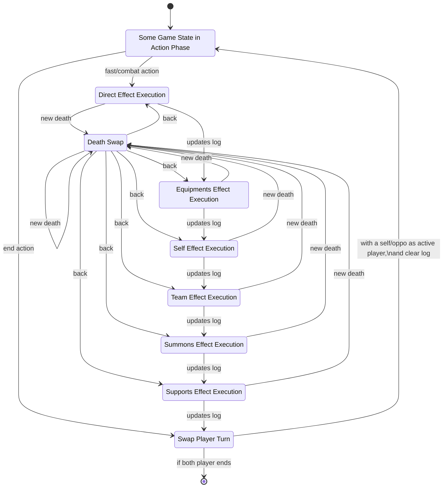
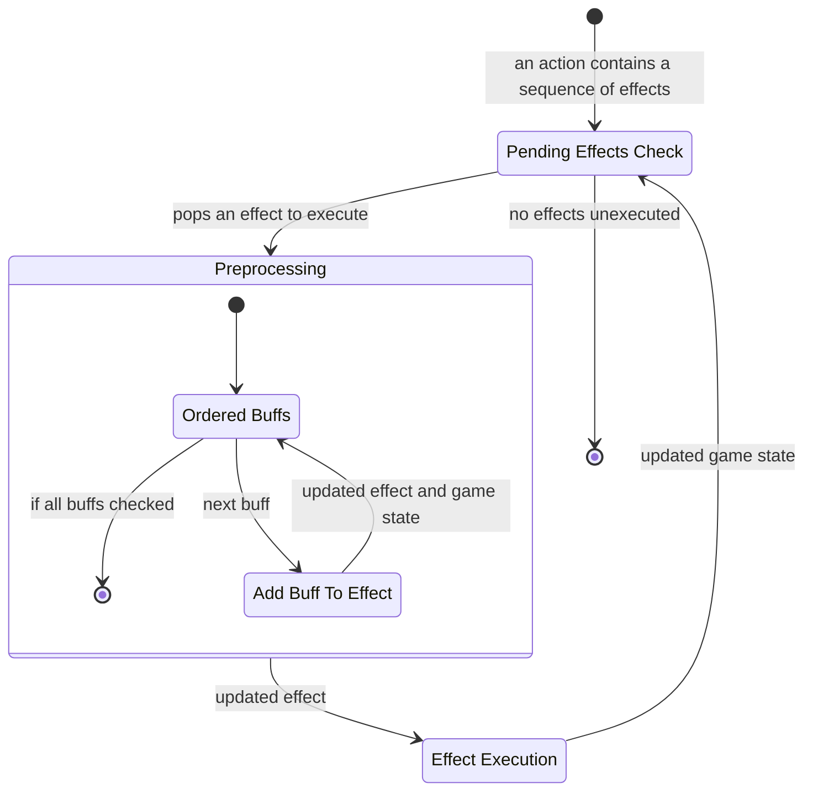

# Flow Chart

***Note That the Following Design Is Partially Adopted Into The Actual Project***

## General Phases

## Action Phase

`p1,w,a` means this is player1's turn. Player1 is in waiting phase and player2 is in action phase.

`px,w,a` means player `x` is one of player 1 or player 2, and player `y` is the opponent. So both `p1,w,a` and `p2,a,w` can be fit into `px,w,a`.

- `a` is action phase
- `w` is waiting phase
- `e` is end phase

## Action Execution Flow

Not that all effects after direct effect are executed only if their preconditions are satisfied. (e.g. action event matches, elemental reaction happens...)

## Action Execution in detail

An action consists of a number of effects, some are bounded to be executed together, some can be seperated.

In the chart below, `e` is used to denote a single effect or a sequence of effects inseperable, `es` is used to denote the rest of effects in the effect queue.

